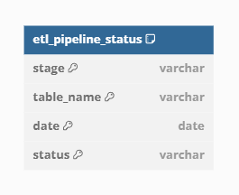

# Introduction
This is a self-learning project on ETL using different technologies:
 * Spark
 * Airflow
 * Docker
 * APIS with fast api, SqlAlchemy and Pydantic
 * Data lakehouse arquitechture using delta table format
 * Databases: PostgreSQL
 
 Data data used was fetched from the IMDb datasets that can be found at https://datasets.imdbws.com/ and the corresponding documentation can be found at https://developer.imdb.com/non-commercial-datasets/

 The goal of this project is to serve an api with information on the List of [actor/actress] ordered by their rating score, which we will calculate by the average of movie ratings. This documentation first explains how the project is structured and in the end, gives a clear explanation of how to reproduce the same in the reader's machine.

 The topics will be covered in the following order:
 * Etl process applied
 * Orchestration
 * API
 * How it works

# Elt process applied
The etl process consists of different phases. I followed a similar approach to the one used in the lakehouse architecture. For this I used the delta table table format.

There are 4 layers:
* Cache layer: This is the first layer where I store data retrieved from the imdb website. This data is then cached in a folder. This serves as a staging layers, so if a new ingestion needs to be done on the same day, the data is already in the cache layer, there is no need to again hit the imdb website
* Landing_zone: This layer is when I convert all tables from the tsv format into delta lake format. This ensures that there is a historical track of the changes made in the data, thanks to delta time travel features. Besides that, here incremental loading is applied, using an upsert logic, by using delta merge command
* Cleansed_zone: This layer would normally be used as a source of truth for the organization, in this case for the use case. But because of the nature of this project, I decided to just model the tables I would need for the final output table, creating a star schema data model. This model can be seen in the below image:

*Aggregated_zone: This is the final layer, where a single table was designed, this is the table that is then saved in PostgreSQL to be used by the api endpoint. The table can be consulted below:

To conclude this chapter is important to note that all stages runs are stored inside a metadata table. This table is represented below:

 

Notes:
    * Some limitations of the volume of the data were applied, because of hardware limitations on my laptop. 
    * The incremental process could also be applied to the cleansed_zone, where joins are not applied. So, when only cast and transformations were applied, there is the possibility to select only the records that were inserted in the latest batch.

Finally, the etl_pipeline_status and actor_actress_kpis were uploaded into PostgreSql, with actor_actress_kpis having an index on role,
that would be used by the api

# Orchestration

In this step, airflow was applied with the dag represented below to run daily: 

The steps represented in the image are self-explanatory. The only thing I want to point out are the first 4 steps and the last one. 
* The step create_postgre_conn is used to create a conn between airflow and the postgreSql.
* The steps create table are used to create the table on the postgreSql database side
* The step create_spark_conn is used to create a conn between airflow and the local mode of spark
* Finally the write metadata table is used to write the etl pipeline status table into postgreSql, independently if the stages ran with success

# API

The api was built using fastapi and has 2 endpoints top_actor_actress and etl_pipeline_status. The first endpoint represents a post request. By providing actor, actress or both, the list with information on top actors and actresses is returned. The second endpoint,etl_pipeline_status, is used to provide information on the status of the pipeline for a specific data.

This apis uses fastApi, SqlAlchemy as a way to abstract Sql and the queires/tables and finally pydantic to evaluate both the output from PostgreSql and the user input

# Next steps:

Include linter for example black and include pytest for unit test. Automate this with tox
Include data quality tools like soda or great expectations

# How it works

The first step is to clone the repo from github. After that, make sure you are using the bash int terminal and you have docker installed. Run the following commands, in the order provided:

* ./create_storage_directories.sh : This command creates the directories used for storage for the lakehouse. This will be mapped into the docker container running airflow
* docker compose up airflow-init
* docker compose up

After these steps, you can go to your preferred web browser and search for post 8080 in your localhost. This will open airflow, 
Then you can insert user and password, both are airflow

Then run the pipeline or wait for it to run daily. 

After the dag completes, then the data will be available on PostgreSql, so you can already use the api. The server running the api is 
already up, as a result of docker compose up.

To use the api, you can use the solution that you like the most, as an example you can use the following:

etl_pipeline_status endpoint: curl -X POST http://localhost:8008/etl_pipeline_status/ -H "Content-Type: application/json" -d '{"date": "2024-01-15"}'
top_actor_actress endpoint: curl -X POST http://localhost:8008/top_actor_actress/ -H "Content-Type: application/json" -d '{"role": "actor"}'

Note: This project is only for self learning, in a production env, appropriate config files with info on the users and password should be used to not compromise security

